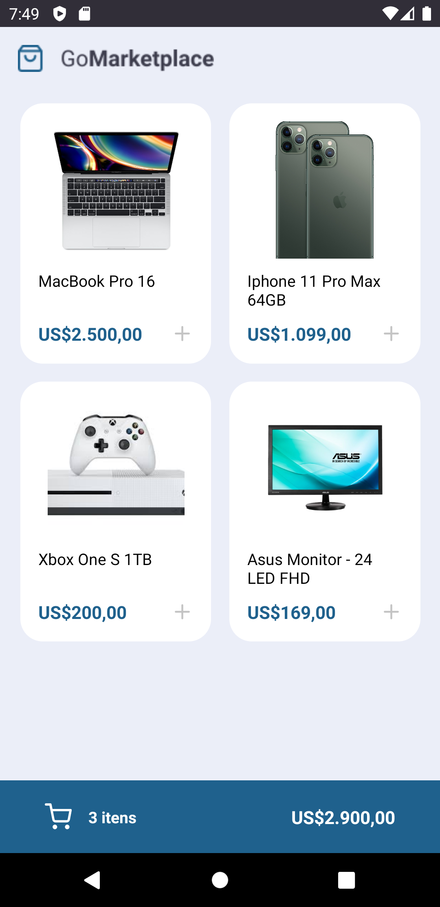
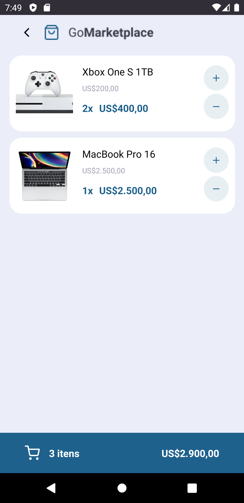

<h3 align="center">
   🌐 GoMarket
</h3>

🇺🇸App made in a BootcampGoStack challenge, create a basic e-commerce application, products must be added to the cart and the items calculated and the total value calculated

🇧🇷 App feito em um desafio do BootcampGoStack, criar uma aplicação básica de um e-commerce, os produtos devem ser adicionados ao carrinho e feito o calculo de itens e o calculo do valor total.

## 📱 Mobile app

<h3 align="center"><strong> 🏠 Home</h3>

<h3 align="center"><strong> Cart 🚙</h3>

<h3 align="center"><strong> Test Result 🔬 </h3>

